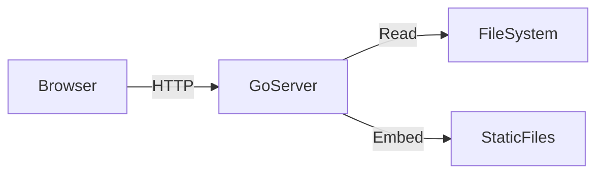
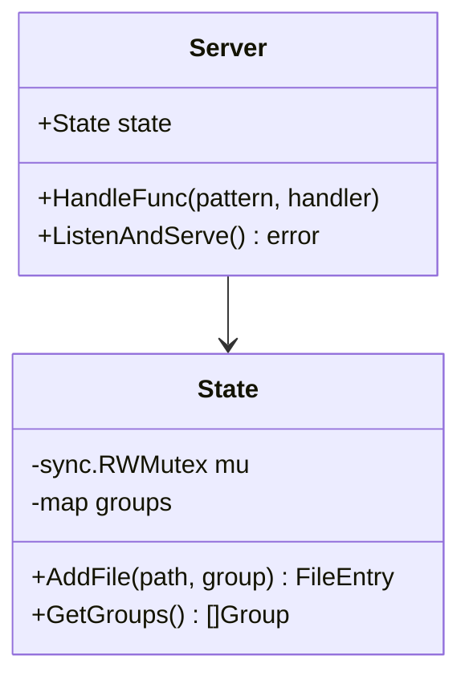
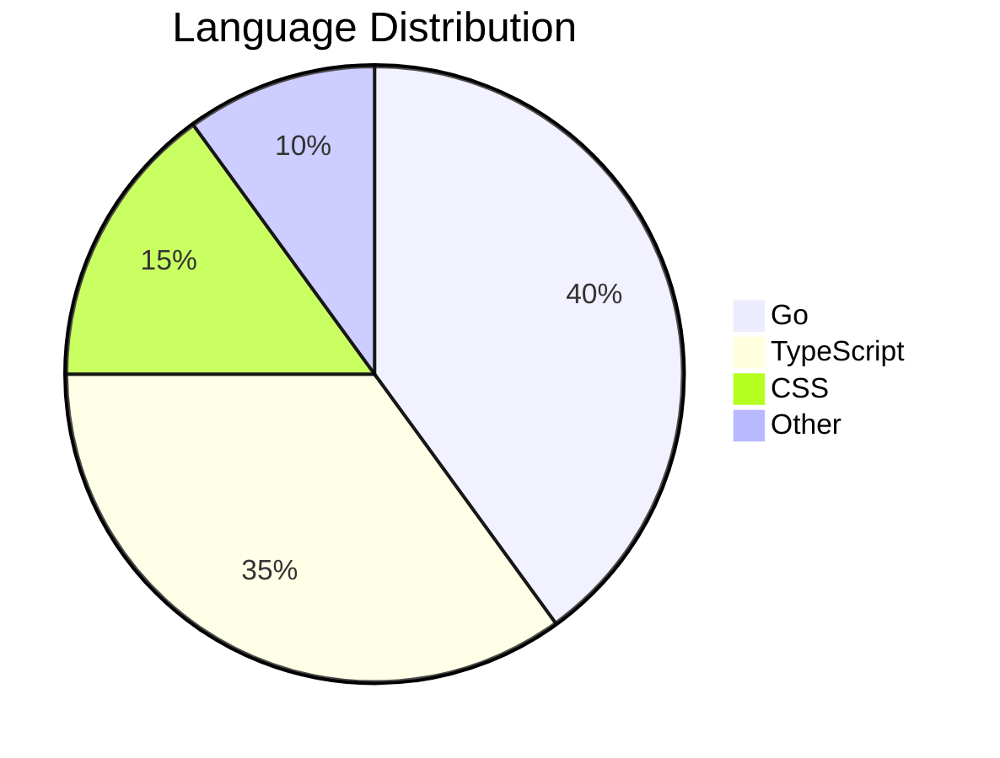

# Mermaid + Code Mixed

This file contains both mermaid diagrams and regular code blocks.

## Architecture



## Go Code

```go
func main() {
    fmt.Println("Hello, po!")
}
```

## Class Diagram



## JSON Example

```json
{
  "name": "po",
  "version": "0.1.0"
}
```

## Pie Chart


